<h1 align="center"><br>Goink<br><sub>桌面 AI 写作系统 — Agent 实时决策 × 结构化记忆 × 写完自检</sub></h1>

<p align="center"><strong><a href="README_EN.md">English</a> | 中文</strong></p>

---

> 基于 [sigpanic/goink](https://github.com/sigpanic/goink) v1.1 fork，大幅扩展了创作模块、工具系统和工程能力。

<p align="center">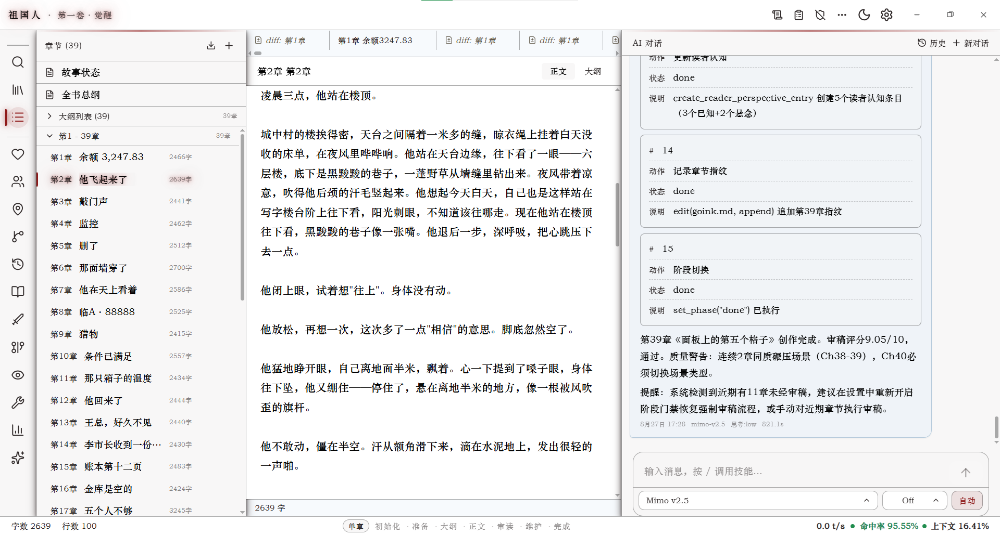
<br><sub>书架主页 — 小说列表、字数统计、当前书籍</sub></p>

---

## 目录

- [特色功能](#特色功能)
- [安装](#安装)
- [项目结构](#项目结构)
- [技术栈](#技术栈)
- [与上游对比](#与上游对比)
- [License](#license)

---

## 特色功能

### 工业化创作管线

Goink 的核心是一套**五阶段门禁管线**，规范 AI 从准备到维护的完整创作流程：

```
prepare → outline → write → review → maintain → done
```

- **prepare**：`get_writing_context` 一次获取全量上下文（角色/弧线/伏笔/读者认知/场景/物品/统计）
- **outline**：将大纲写入 `outlines/NNN.md`
- **write**：将正文写入 `chapters/NNN.md`，字数达标后门禁放行
- **review**：启动审稿子 Agent，逐项检查角色一致性、设定矛盾、伏笔回收、弧线推进
- **maintain**：强制回写角色/时间线/弧线/读者认知等所有状态，15 项检查清单

每阶段有 **tools 白名单**和 **require 必调列表**，不满足条件无法推进到下一阶段。门禁配置存数据库，不占 AI 上下文。

<p align="center">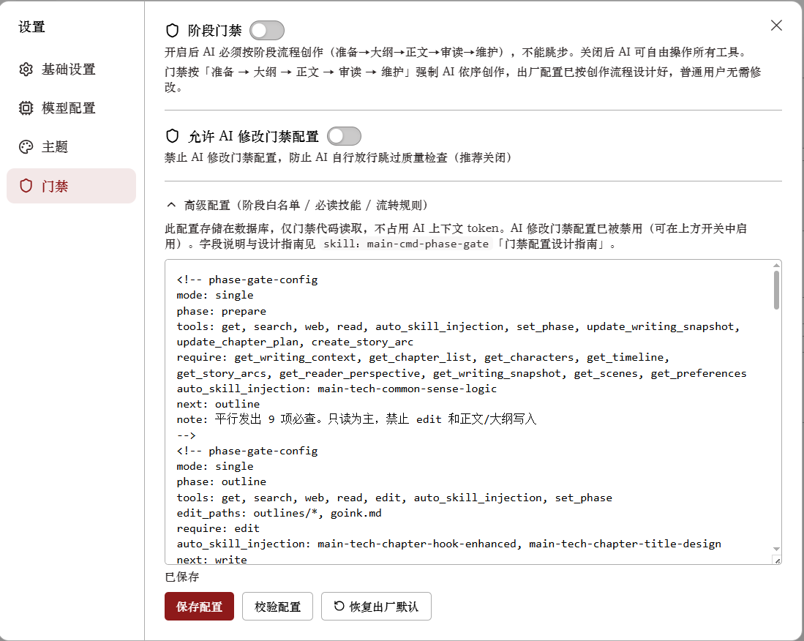
<br><sub>阶段门禁 — 每阶段 tools 白名单 + require 必调列表</sub></p>

<p align="center">
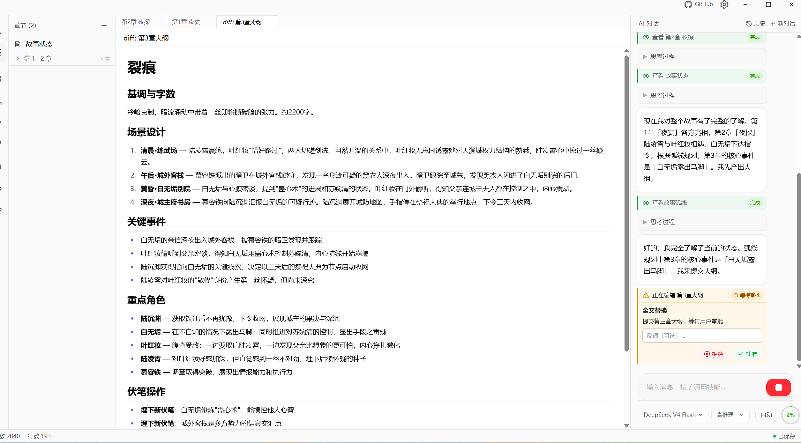 &nbsp;&nbsp; 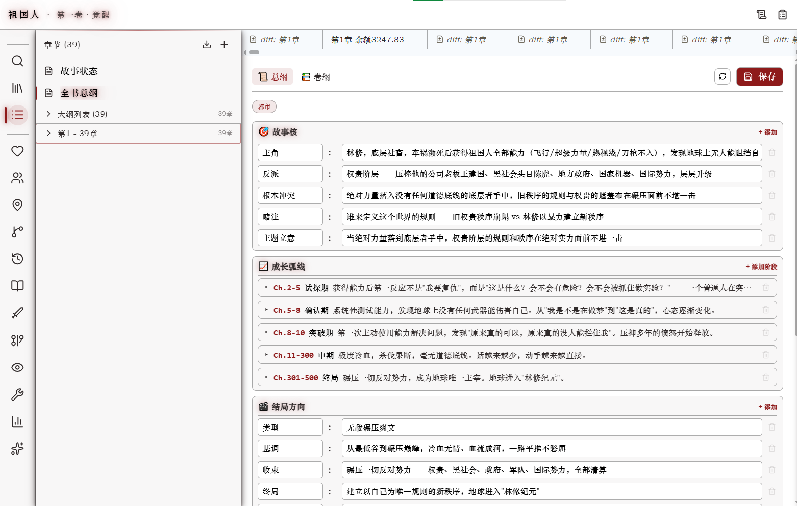
<br><sub>大纲编辑（左）/ 总纲（右）</sub>
</p>

<p align="center">
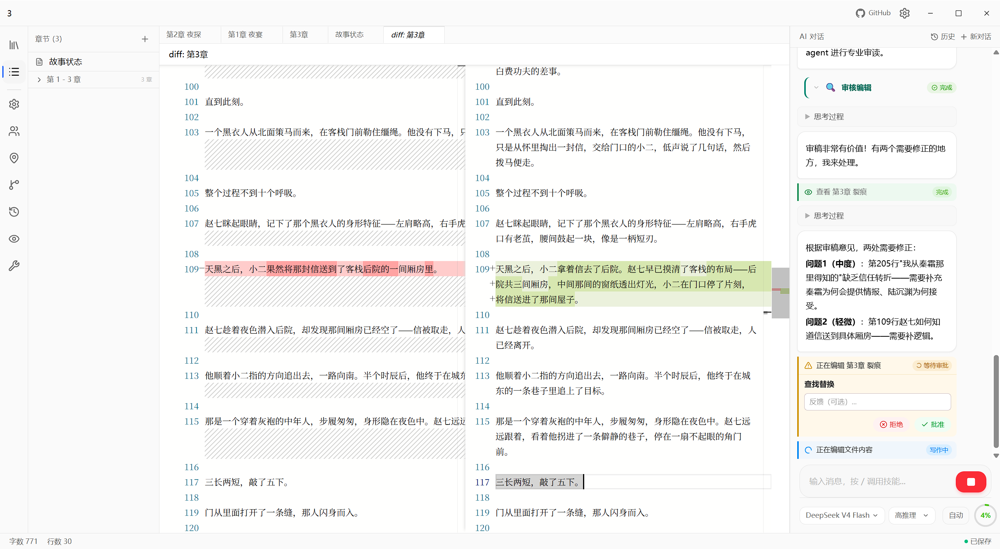 &nbsp;&nbsp; 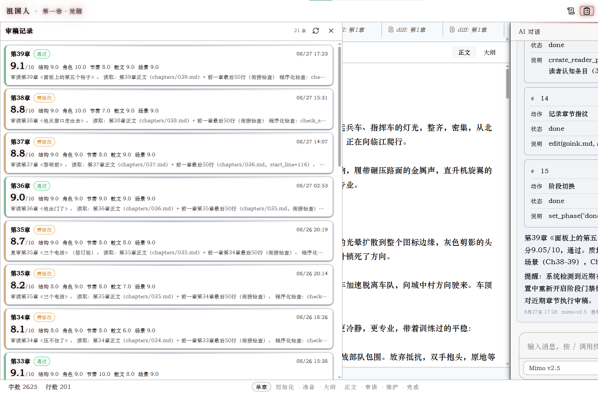
<br><sub>正文写作（左）/ 审稿记录（右）</sub>
</p>

<p align="center">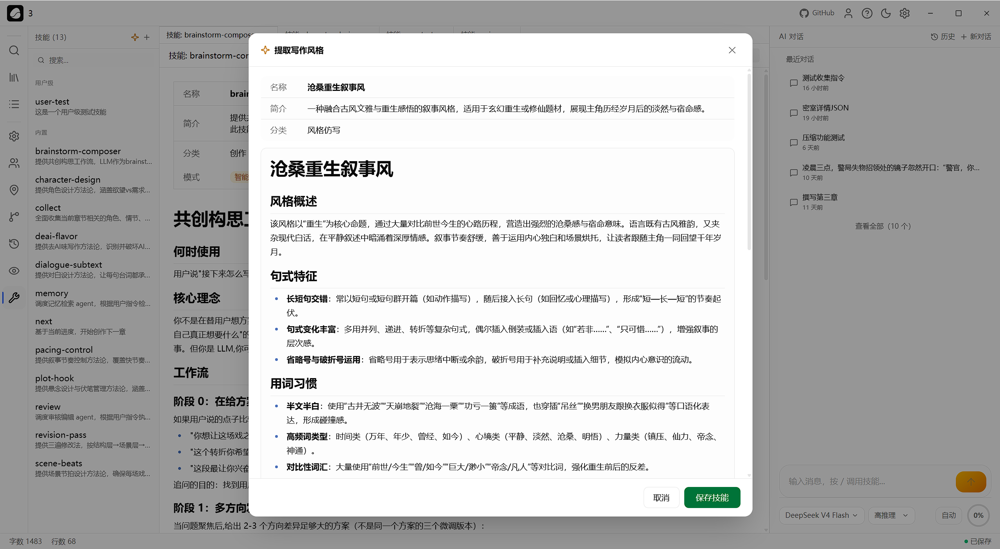
<br><sub>提取写作风格</sub></p>

### 8 个全新创作模块

| 模块 | 能力 |
|------|------|
| 世界观设定（Lore） | 5 个 MCP 工具 + 前端 UI，arc_id 关联弧线 |
| 物品/法宝（Item） | 5 个 MCP 工具 + 前端 UI，arc_id 关联弧线 |
| 物品流转记录（ItemOccurrence） | 追踪物品在各章节的出现和状态变化 |
| 场景管理（Scene） | 4 个 MCP 工具，arc_node_id 关联弧线节点 |
| 章节元数据（ChapterMeta） | summary / key_events / characters_in / arc_ids |
| 树状上下文（WritingContext） | 一次调用获取 8 个数据源 + 超期伏笔检测 |
| 写作进度快照（Snapshot） | current_arc_id / active_chars / summary / detailed_state |
| 创作统计（Stats） | 字数 / 弧线进度 / 伏笔回收率 / 角色数 / 地点数 |

<p align="center">
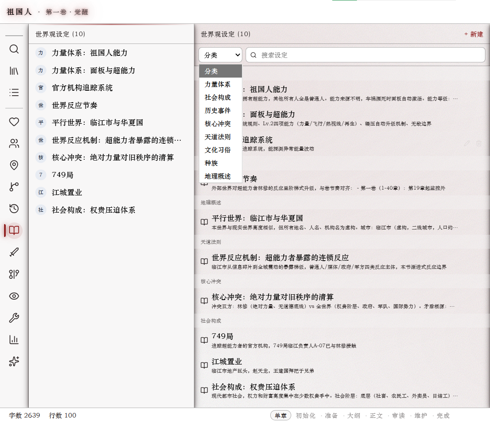 &nbsp;&nbsp; 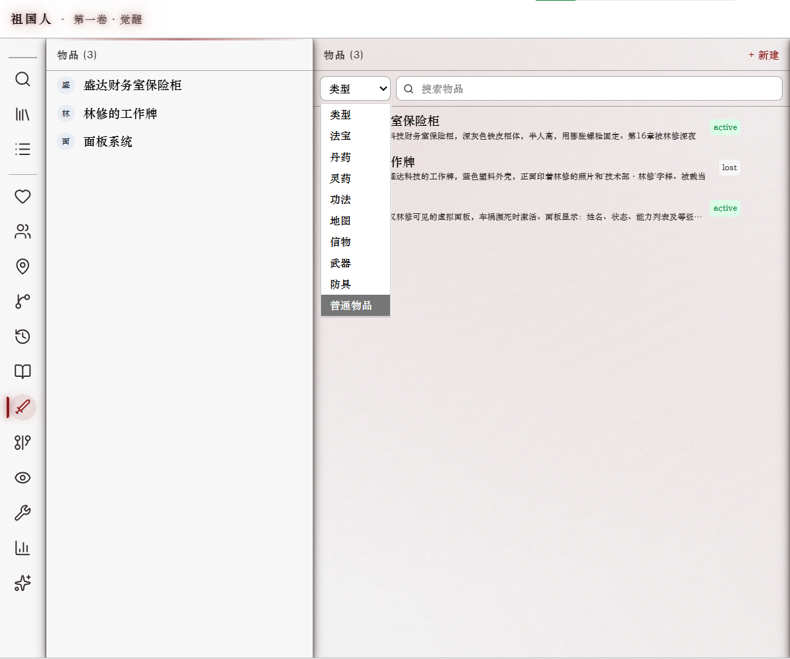
<br><sub>世界观设定（左）/ 物品管理（右）</sub>
</p>

<p align="center">
 &nbsp;&nbsp; 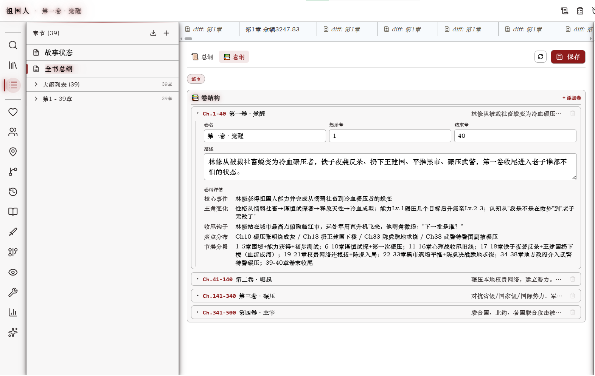
<br><sub>弧线节点（左）/ 卷纲（右）</sub>
</p>

<p align="center">
 &nbsp;&nbsp; 
<br><sub>地点关系（左）/ 偏好（右）</sub>
</p>

### HTTP API + 移动端

37 个 API 端点（含 SSE 对话流与 WebSocket 双端同步），手机浏览器可完整使用 Goink：

- **书架**：小说列表、字数统计、当前书籍标识
- **小说详情**：章节/角色/时间线/弧线/读者/偏好/地点/世界观/物品 九大模块
- **全屏阅读器**：字号行距调节、左右翻页、章节目录、进度记忆
- **AI 对话**：流式 SSE、思考过程、会话历史、模型切换、复制按钮
- **设置**：深浅模式、中英语言、Token 管理、模型选择

```
GET  /api/health               健康检查
GET  /api/info                 服务器信息
GET  /api/sync/state           同步状态
GET  /api/novels               小说列表
GET  /api/novels/{id}/chapters 章节列表
GET  /api/chapters/{id}        章节内容
GET  /api/characters           角色
GET  /api/character-relations  角色关系
GET  /api/locations            地点
GET  /api/location-relations   地点关系
GET  /api/lore                 世界观设定
GET  /api/items                物品
GET  /api/item-occurrences     物品流转记录
GET  /api/scenes               场景
GET  /api/timeline             时间线
GET  /api/arcs                 弧线
GET  /api/arc-nodes            弧线节点
GET  /api/reader               读者认知
GET  /api/preferences          偏好
GET  /api/writing-snapshot     写作快照
GET  /api/phase-gate-config    门禁配置
GET  /api/writing-context      树状上下文
GET  /api/search-memory        语义搜索
GET  /api/read                 读取文件
GET  /api/stats                统计
GET  /api/sessions             会话列表
POST /api/chat                 AI 对话（SSE）
POST /api/chat/cancel          取消对话
POST /api/settings/model       模型切换
WS   /api/ws                   双端同步 WebSocket
```

Bearer Token 认证，详见 [mobile/API.md](mobile/API.md)。

- **离线缓存**：`idb-keyval` + 内存 Map 双缓存，断网秒读
- **Service Worker**：预缓存静态资源，断网页面骨架正常加载
- **双端实时同步**：桌面端与移动端 WebSocket 全双工同步
- **扫码连接**：桌面端 Token 二维码，手机扫码快速连接
- **自动 HTTPS**：启动时自动生成证书
- **移动端主题**：白底蓝强调色（HSL 自定义主题，支持 56+ CSS 变量）

<p align="center">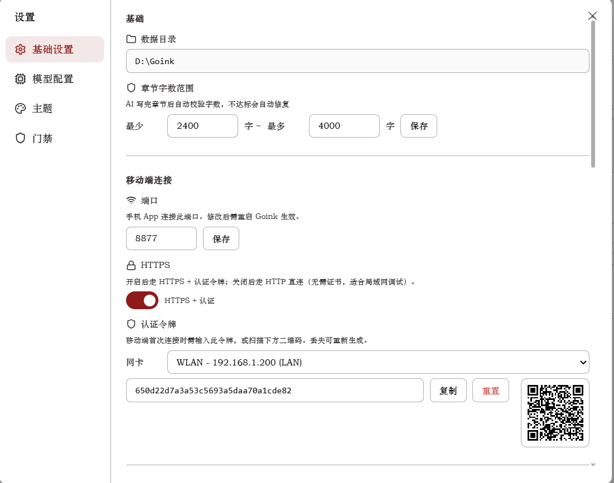
<br><sub>移动端连接 — 扫码快速连接</sub></p>

### 动态叙事面板

画布式可拖拽/缩放卡片面板，一次 IPC 调用聚合全部写作上下文：

- 7 张卡片：当前/过去/未来/弧线/伏笔/读者/详细设定
- 四边四角拖拽缩放，自动吸附其他卡片边缘
- 卡片标题可双击重命名，布局存 localStorage
- 实时刷新：监听文件变更和对话事件，300ms 防抖

<p align="center">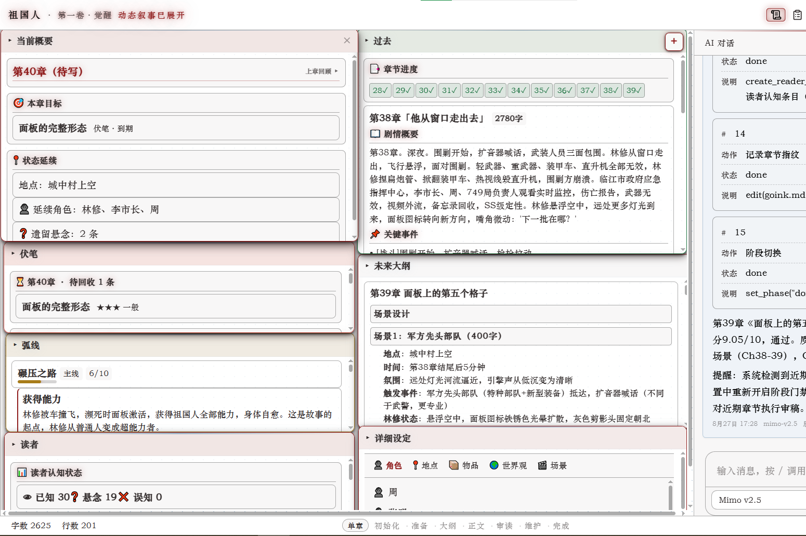
<br><sub>动态叙事面板 — 画布式可拖拽/缩放卡片</sub></p>

### 60 个 MCP 工具

AI 通过 60 个 Function Calling 工具管理小说的全部数据。工具按领域划分，每个工具都有详尽的 description 教会 AI 创作方法论（世界观分类、伏笔回收节奏、悬念反转设计）。

新增工具分类：

| 分类 | 工具数 | 说明 |
|------|--------|------|
| 世界观（Lore） | 5 | CRUD + 语义搜索 |
| 物品（Item） | 5 | CRUD + 语义搜索 |
| 物品流转（ItemOccurrence） | 2 | 追踪物品出现和状态 |
| 场景（Scene） | 4 | CRUD |
| 统计（Stats） | 1 | 创作数据聚合 |
| 快照（Snapshot） | 2 | 写作进度快照读写 |
| 门禁（PhaseGate） | 2 | 门禁配置读写 |
| 树状上下文（WritingContext） | 1 | 一次获取 8 个数据源 |
| 章节元数据（ChapterMeta） | 1 | 更新章节摘要/事件/角色 |
| 网络搜索/抓取（WebSearch） | 2 | Exa API 搜索 + 网页抓取 |
| 子 Agent（Subagent） | 1 | 启动审稿/记忆子 Agent |
| 通用删除（Delete） | 1 | 删除任意记录 |

<p align="center">
<br><sub>42 个内置 Skill — 三层系统零代码扩展</sub></p>

### 42 个 Skill（技能系统）

三层 Skill 系统（内置/用户/小说 x auto/manual/always），零代码扩展：

| 分类 | 数量 | 说明 |
|------|------|------|
| 核心系统（core） | 5 | 创作流程调度、阶段初始化 |
| 写作技术（tech） | 20+ | 展示而非讲述、章节钩子、对白潜台词、节奏控制、伏笔循环等 |
| 类型专精（type） | 8 | 玄幻修仙、都市武侠、末世生存、悬疑规则怪谈、历史穿越等 |
| 子技能（sub） | 8 | 审稿标准、反 AI 检测评分等 |

### 模型配置增强

- 自动获取模型列表（`DiscoverModels`）
- 思考模式支持（`ReasoningEffort`：high / max）
- 单轮最大轮次：100
- LLM 自动重试：429 限流和可重试错误指数退避，最长 60 秒
- 可配置压缩阈值（默认 0.7）
- 网络搜索：Exa API

### 计费面板

- 兼容 OpenAI 标准格式 + DeepSeek 格式缓存字段
- 按模型独立累计消耗
- Token 趋势图（日期 + 模型聚合，SVG 饼图）
- 缓存命中率实测 89-93%

<p align="center">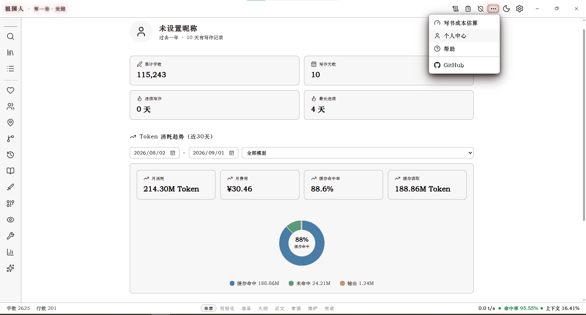
<br><sub>计费面板 — 按模型独立累计 + Token 趋势图</sub></p>

<p align="center">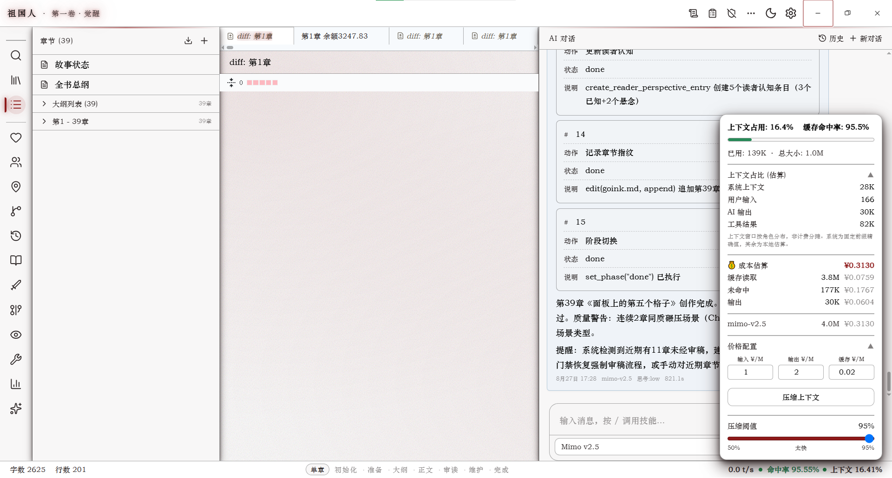
<br><sub>Token 消耗面板 — 会话级 token 分类统计</sub></p>

### 内置 WebDAV

- 可配置端口/用户/密码
- 对话结束后自动导出 TXT
- 手机文件管理器直接阅读

### 自定义主题

- 67 个 CSS 变量全量覆盖
- 亮色/暗色双模式
- JSON 粘贴即应用
- 示例主题「墨绿书斋」
- `normalizeTheme()` 自动补全缺失变量

<p align="center">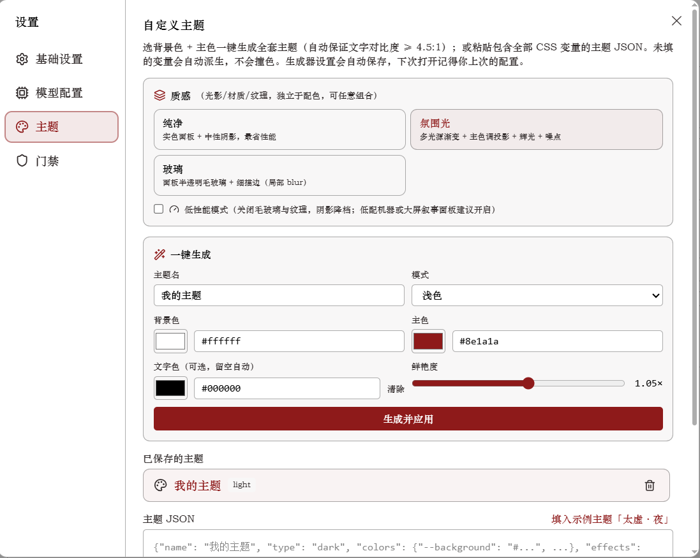
<br><sub>自定义主题 — JSON 粘贴即应用</sub></p>

### 图标替换

| 位置 | 用途 | 格式 |
|------|------|------|
| `build/windows/icon.ico` | exe 文件图标 + 窗口标题栏图标 | ICO（多尺寸） |
| `appicon.png` | Wails 构建用的应用图标 | PNG |
| `frontend/public/logo.svg` | 标题栏左上角 Logo | SVG |
| `frontend/public/favicon.svg` | 浏览器标签页图标 | SVG |
| `assets/logo.svg` | Logo 源文件 | SVG |

**替换步骤：**

1. 准备新图标（推荐 SVG 或高清 PNG）
2. 替换对应文件：
   - **exe 图标**：用在线工具将 PNG 转为 ICO，替换 `build/windows/icon.ico`
   - **应用图标**：将 PNG 放到项目根目录，重命名为 `appicon.png`，同时复制到 `build/appicon.png`
   - **标题栏 Logo**：将 SVG 放到 `frontend/public/logo.svg`
   - **Favicon**：将 SVG 放到 `frontend/public/favicon.svg`
3. 运行 `.\build.ps1` 重新构建
4. 若 exe 图标未更新，清除 Windows 图标缓存或重启电脑

### 安全

- **双层沙箱**：正则白名单 + SafePath 杜绝路径穿越
- **文件编辑**：写入前重读对比，防止覆盖手动修改
- **API 认证**：Bearer Token，自动生成
- **操作日志**：所有 DB 变更操作可审计

---

## 安装

### 运行时依赖

- **Windows 10+**：仅需 WebView2 Runtime（系统内置）
- **macOS 11+**：仅需系统 WebView
- **Linux**：需要 WebKit2GTK 4.1

### 从源码构建

```powershell
# Windows
.\build.ps1

# macOS / Linux
make build
```

构建产物在 `build/bin/` 目录，自动部署到 `D:\Goink\`（Windows）或同级目录。

---

## 项目结构

```
goink-fork/
├── main.go              # 入口
├── app/                 # Wails 绑定层（42 文件）
│   ├── handler.go       #   App 结构体 + 生命周期
│   ├── chat.go          #   对话入口
│   ├── api_server.go    #   HTTP API 服务器
│   ├── novel.go         #   小说 CRUD
│   └── ...              #   视图 API、设置、备份、内容编辑
├── internal/            # 核心逻辑（~150 文件）
│   ├── agent/           #   ReAct Agent 引擎 + 阶段门禁
│   ├── agentcfg/        #   系统提示词 + 工具白名单
│   ├── mcp_tools/       #   60 个 MCP 工具注册表
│   ├── llm/             #   多供应商 LLM 客户端
│   ├── skill/           #   三层 Skill 系统（42 内置）
│   ├── rag/             #   向量检索（ONNX + sqlite-vec）
│   ├── search/          #   三路合并搜索
│   ├── session/         #   会话存储
│   ├── storage/         #   SQLite 连接池
│   ├── git/             #   内置 Git 管理
│   ├── migrate/         #   25 张表自动迁移
│   ├── ws/              #   WebSocket 同步
│   ├── cert/            #   自签名证书
│   ├── webdav/          #   局域网文件共享
│   ├── export/          #   TXT/MD/EPUB/DOCX
│   ├── import/          #   TXT/EPUB/LLM 导入
│   └── 20+ 领域 Store   #   角色/地点/弧线/时间线/等
├── frontend/            # React 桌面端（70+ 文件）
│   └── src/
│       ├── components/  # 25+ 组件目录
│       │   ├── chat/    #   对话面板
│       │   ├── content/ #   内容编辑器
│       │   ├── narrative/ # 叙事面板
│       │   ├── character/ # 角色图谱
│       │   ├── settings/  # 设置
│       │   └── ...
│       └── i18n/        # 中英双语
├── mobile/              # 移动端 Web 前端
│   ├── app.js           #   应用逻辑（77k 行）
│   ├── style.css        #   样式（33k 行）
│   └── API.md           #   API 文档
├── skills/              # 常驻调度 Skill
├── docs/                # 文档
│   ├── architecture/    #   系统设计
│   ├── adr/             #   决策记录
│   ├── design/          #   方案
│   └── archive/         #   归档
└── tokencount/          # Token 统计工具
```

---

## 技术栈

| 层 | 选型 |
|---|---|
| 桌面框架 | Wails v2 (Go + WebView2) |
| 前端 | React 18 + TypeScript + Tailwind CSS + shadcn/ui |
| 后端 | Go 1.26, GORM + SQLite |
| Agent 引擎 | ReAct 循环 (SSE + 59 工具 + 子 Agent, MaxTurns 100) |
| 向量搜索 | ONNX Runtime (BGE 中文) + sqlite-vec |
| 版本控制 | 内置 Git (每本小说独立仓库) |
| 移动端 | 原生 JS + idb-keyval + Service Worker |
| 国际化 | react-i18next (中/英) |

---

## 与上游对比

本 fork 基于 [sigpanic/goink](https://github.com/sigpanic/goink) v1.1，以下是主要差异：

### 创作模块

| 模块 | 上游 v1.1 | 本 fork |
|------|-----------|---------|
| 世界观设定（Lore） | 无 | 5 个 MCP 工具 + 前端 UI |
| 物品/法宝（Item） | 无 | 5 个 MCP 工具 + 前端 UI |
| 物品流转记录 | 无 | 2 个 MCP 工具 |
| 场景管理（Scene） | 无 | 4 个 MCP 工具 |
| 章节元数据 | 无 | summary / key_events / characters_in |
| 树状上下文 | 无 | 一次获取 8 个数据源 |
| 写作快照 | 无 | 进度快照 |
| 创作统计 | 无 | 字数/弧线/伏笔统计 |

### 工具与技能

| 指标 | 上游 v1.1 | 本 fork |
|------|-----------|---------|
| MCP 工具 | 33 个 | **60 个** |
| 内置 Skill | 12 个 | **42 个** |
| 数据库表 | 17 张 | **25 张** |

### 工程能力

| 功能 | 上游 v1.1 | 本 fork |
|------|-----------|---------|
| 阶段门禁 | 无 | 5 阶段校验 + 白名单 + require |
| HTTP API | 无 | 37 端点（含 SSE 对话 + WebSocket） |
| 移动端 | 无 | 完整 Web 前端 + 离线缓存 |
| WebDAV | 无 | 内置服务器 |
| 计费面板 | 无 | Token 统计 + 趋势图 |
| 叙事面板 | 无 | 7 卡片画布式布局 |
| 自定义主题 | 无 | 67 CSS 变量 |
| DOCX 导出 | 无 | 纯标准库实现 |
| Wails 版本 | v2.12.0 | **v2.13.0** |
| Go 版本 | 1.25 | **1.26** |
| 单轮最大轮次 | 50 | **100** |
| 网络搜索 | DeepSeek | **Exa API** |

### 数据管线

```
上游：get_* 逐个调用 → 手动维护
本 fork：prepare(get_writing_context) → outline → write → review → maintain(强制回写)
```

- prepare require `get_writing_context` 一次获取全量状态
- maintain require `update_chapter_meta` + `update_writing_snapshot` + `search_lore` + `search_items` 强制回写
- 双层 required：门禁 require 强制调用工具，jsonschema required 强制填完整字段

### 字段扩展

| 表 | 新增字段 |
|----|----------|
| chapters | avatar_url, summary, key_events, characters_in |
| characters | avatar_url, location_id, description |
| locations | avatar_url, location_type, description |
| sessions | current_phase, called_tools, reasoning_effort |
| messages | thinking_content, extra_metadata, agent_type, sub_task_id |

---

## License

AGPL-3.0. See [LICENSE](LICENSE).
