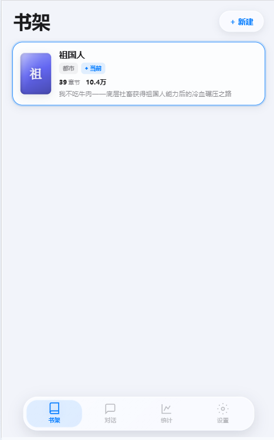
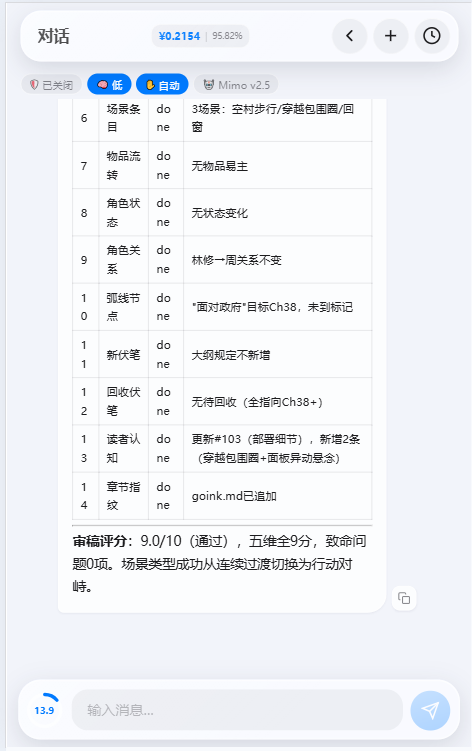
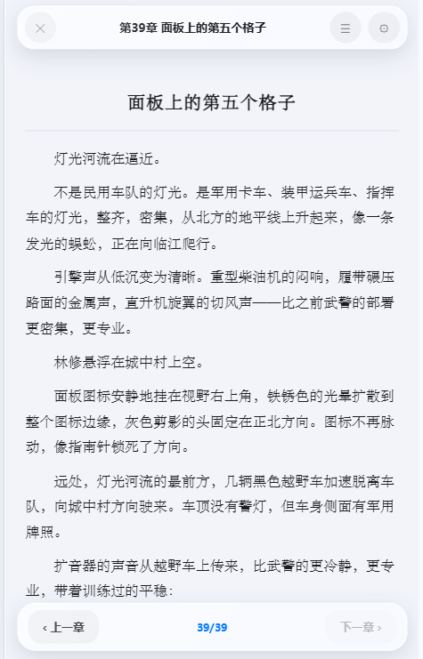
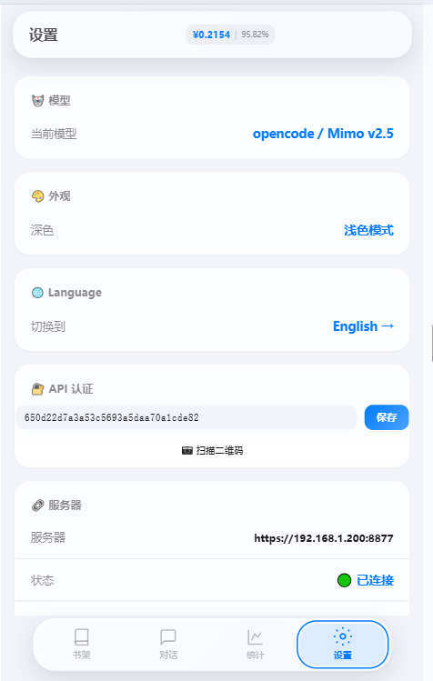

<h1 align="center"><br>Goink<br><sub>Desktop AI Writing System — Agent Real-time Decisions × Structured Memory × Post-Write Self-Check</sub></h1>

<p align="center"><strong>English | <a href="README.md">中文</a></strong></p>

---

> Forked from [sigpanic/goink](https://github.com/sigpanic/goink) v1.1, with significant expansion of creative modules, tool system, and engineering capabilities.

<p align="center">
<br><sub>Main Page — novel list, word count, current book</sub></p>

---

## Table of Contents

- [Features](#features)
- [Installation](#installation)
- [Project Structure](#project-structure)
- [Tech Stack](#tech-stack)
- [Comparison with Upstream](#comparison-with-upstream)
- [License](#license)

---

## Features

### Industrial-Grade Creative Pipeline

Goink's core is a **five-stage phase-gated pipeline** that guides AI from preparation to maintenance:

```
prepare → outline → write → review → maintain → done
```

- **prepare**: `get_writing_context` fetches full context (characters/arcs/foreshadowing/reader perception/scenes/items/stats) in one call
- **outline**: Write outline to `outlines/NNN.md`
- **write**: Write chapter content to `chapters/NNN.md`, released only when word count meets threshold
- **review**: Launch review sub-agent to check character consistency, setting contradictions, foreshadowing recovery, arc progression
- **maintain**: Force-write all state updates (characters/timeline/arcs/reader perception), 15-item checklist

Each phase has a **tools whitelist** and **require list**. Gate config is stored in DB, not in AI context.

<p align="center">
<br><sub>Phase Gate — per-phase tools whitelist + require list</sub></p>

<p align="center">
<br><sub>Master Outline</sub></p>

<p align="center">
 &nbsp;&nbsp; 
<br><sub>Chapter Writing (left) / Review Records (right)</sub>
</p>

### 8 New Creative Modules

| Module | Capabilities |
|--------|-------------|
| Worldbuilding (Lore) | 5 MCP tools + frontend UI, arc_id linkage |
| Items/Artifacts (Item) | 5 MCP tools + frontend UI, arc_id linkage |
| Item Occurrences | Track item appearances and state changes across chapters |
| Scene Management (Scene) | 4 MCP tools, arc_node_id linkage |
| Chapter Metadata (ChapterMeta) | summary / key_events / characters_in / arc_ids |
| Tree Context (WritingContext) | 8 data sources in one call + overdue foreshadowing detection |
| Writing Snapshot (Snapshot) | current_arc_id / active_chars / summary / detailed_state |
| Creative Stats (Stats) | word count / arc progress / foreshadowing recovery rate / entity counts |

<p align="center">
 &nbsp;&nbsp; 
<br><sub>Worldbuilding (left) / Items (right)</sub>
</p>

<p align="center">
<br><sub>Volume Outline</sub></p>

### HTTP API + Mobile Frontend

37 API endpoints (including SSE chat stream and WebSocket dual-end sync), full Goink functionality from mobile browser:

```
GET  /api/health               health check
GET  /api/info                 server info
GET  /api/sync/state           sync state
GET  /api/novels               novel list
GET  /api/novels/{id}/chapters chapter list
GET  /api/chapters/{id}        chapter content
GET  /api/characters           characters
GET  /api/character-relations  character relations
GET  /api/locations            locations
GET  /api/location-relations   location relations
GET  /api/lore                 worldbuilding entries
GET  /api/items                items
GET  /api/item-occurrences     item occurrences
GET  /api/scenes               scenes
GET  /api/timeline             timeline
GET  /api/arcs                 story arcs
GET  /api/arc-nodes            arc nodes
GET  /api/reader               reader perspective
GET  /api/preferences          preferences
GET  /api/writing-snapshot     writing snapshot
GET  /api/phase-gate-config    phase gate config
GET  /api/writing-context      tree context
GET  /api/search-memory        semantic search
GET  /api/read                 read file
GET  /api/stats                statistics
GET  /api/sessions             session list
POST /api/chat                 AI chat (SSE)
POST /api/chat/cancel          cancel chat
POST /api/settings/model       model switch
WS   /api/ws                   dual-end sync WebSocket
```

Bearer Token auth, see [mobile/API.md](mobile/API.md).

- **Offline cache**: `idb-keyval` + in-memory Map dual cache, instant load offline
- **Service Worker**: pre-cache static assets, page skeleton loads offline
- **Real-time sync**: WebSocket full-duplex between desktop and mobile
- **QR connect**: desktop shows token QR code, phone scans to connect
- **Auto HTTPS**: self-signed certificate generated on startup
- **Mobile theme**: white background with blue accent (HSL custom theme, 56+ CSS variables)

<p align="center">
<br><sub>Mobile Connection — scan QR to connect</sub></p>

<p align="center">
 &nbsp;
 &nbsp;
 &nbsp;

<br><sub>Mobile: Bookshelf / Chat / Chapter / Settings</sub>
</p>

### Dynamic Narrative Panel

Canvas-style draggable/resizable card panel, aggregating all writing context via a single IPC call:

- 7 cards: current / past / future / arcs / foreshadowing / reader / detailed settings
- Drag from all edges and corners, auto-snap to other card edges
- Double-click card titles to rename, layout persisted to localStorage
- Real-time refresh: listens for file changes and chat events, 300ms debounce

<p align="center">
<br><sub>Dynamic Narrative Panel — canvas-style draggable/resizable cards</sub></p>

### 60 MCP Tools

AI manages all novel data through 60 Function Calling tools. Tools are organized by domain, each with detailed descriptions teaching AI creative methodology (worldbuilding taxonomy, foreshadowing recovery rhythm, suspense/reversal design).

New tool categories:

| Category | Count | Description |
|----------|-------|-------------|
| Worldbuilding (Lore) | 5 | CRUD + semantic search |
| Items (Item) | 5 | CRUD + semantic search |
| Item Occurrences (ItemOccurrence) | 2 | Track item appearances and state |
| Scenes (Scene) | 4 | CRUD |
| Stats (Stats) | 1 | Creative data aggregation |
| Snapshot (Snapshot) | 2 | Writing progress snapshot read/write |
| Phase Gate (PhaseGate) | 2 | Phase gate config read/write |
| Tree Context (WritingContext) | 1 | 8 data sources in one call |
| Chapter Meta (ChapterMeta) | 1 | Update chapter summary/events/characters |
| Web Search/Fetch (WebSearch) | 2 | Exa API search + web fetch |
| Sub-Agent (Subagent) | 1 | Launch review/memory sub-agent |
| Delete (Delete) | 1 | Delete any record |

### 42 Skills

Three-tier skill system (built-in / user / novel × auto / manual / always), zero-code extensible:

| Category | Count | Description |
|----------|-------|-------------|
| Core (core) | 5 | Creative workflow dispatch, phase initialization |
| Writing Techniques (tech) | 20+ | Show don't tell, chapter hooks, subtext dialogue, pacing, foreshadowing loops |
| Genre Specialization (type) | 8 | Xuanhuan cultivation, urban wuxia, post-apocalyptic, mystery/horror, historical isekai |
| Sub-skills (sub) | 8 | Review standards, anti-AI detection scoring |

### Enhanced Model Configuration

- Auto-fetch model list (`DiscoverModels`)
- Thinking mode support (`ReasoningEffort`: high / max)
- Max turns per round: 100
- LLM auto-retry: exponential backoff on 429 rate limits and retryable errors, up to 60 seconds
- Configurable compression threshold (default 0.7)
- Web search: Exa API

### Billing Panel

- Compatible with OpenAI standard format + DeepSeek cache field format
- Per-model independent accumulation
- Token trend chart (date + model aggregation, SVG pie chart)
- Cache hit rate 89-93% in real-world testing

<p align="center">
<br><sub>Billing Panel — per-model accumulation + Token trend chart</sub></p>

<p align="center">
<br><sub>Token Consumption Panel — session-level token category breakdown</sub></p>

### Built-in WebDAV

- Configurable port / user / password
- Auto-export TXT after chat ends
- Read directly from phone file manager

### Custom Themes

- 67 CSS variables for full coverage
- Light / dark dual mode
- Paste JSON to apply instantly
- Example theme "Ink Green Study"
- `normalizeTheme()` auto-fills missing variables

<p align="center">
<br><sub>Custom Theme — paste JSON to apply</sub></p>

### Icon Replacement

| Location | Purpose | Format |
|----------|---------|--------|
| `build/windows/icon.ico` | exe icon + title bar icon | ICO (multi-size) |
| `appicon.png` | Wails build app icon | PNG |
| `frontend/public/logo.svg` | Title bar logo | SVG |
| `frontend/public/favicon.svg` | Browser tab icon | SVG |
| `assets/logo.svg` | Logo source file | SVG |

**Replacement steps:**

1. Prepare new icon (SVG or high-res PNG recommended)
2. Replace corresponding files:
   - **exe icon**: convert PNG to ICO with an online tool, replace `build/windows/icon.ico`
   - **app icon**: place PNG in project root, rename to `appicon.png`, also copy to `build/appicon.png`
   - **title bar logo**: place SVG in `frontend/public/logo.svg`
   - **favicon**: place SVG in `frontend/public/favicon.svg`
3. Run `.\build.ps1` to rebuild
4. If exe icon doesn't update, clear Windows icon cache or restart

### Security

- **Dual-layer sandbox**: regex whitelist + SafePath to prevent path traversal
- **File editing**: re-read before write to prevent overwriting manual changes
- **API auth**: Bearer Token, auto-generated
- **Audit log**: all DB mutations are auditable

---

## Installation

### Runtime Dependencies

- **Windows 10+**: WebView2 Runtime (built-in)
- **macOS 11+**: system WebView
- **Linux**: WebKit2GTK 4.1

### Build from Source

```powershell
# Windows
.\build.ps1

# macOS / Linux
make build
```

Build output in `build/bin/`, auto-deployed to `D:\Goink\` (Windows) or equivalent directory.

---

## Project Structure

```
goink-fork/
├── main.go              # Entry point
├── app/                 # Wails binding layer (42 files)
│   ├── handler.go       #   App struct + lifecycle
│   ├── chat.go          #   Chat entry
│   ├── api_server.go    #   HTTP API server
│   ├── novel.go         #   Novel CRUD
│   └── ...              #   View APIs, settings, backup, content editing
├── internal/            # Core logic (~150 files)
│   ├── agent/           #   ReAct Agent engine + phase gate
│   ├── agentcfg/        #   System prompts + tool whitelists
│   ├── mcp_tools/       #   60 MCP tool registry
│   ├── llm/             #   Multi-provider LLM client
│   ├── skill/           #   Three-tier Skill system (42 built-in)
│   ├── rag/             #   Vector search (ONNX + sqlite-vec)
│   ├── search/          #   Three-way merged search
│   ├── session/         #   Session storage
│   ├── storage/         #   SQLite connection pool
│   ├── git/             #   Built-in Git management
│   ├── migrate/         #   25-table auto migration
│   ├── ws/              #   WebSocket sync
│   ├── cert/            #   Self-signed certificate
│   ├── webdav/          #   LAN file sharing
│   ├── export/          #   TXT/MD/EPUB/DOCX
│   ├── import/          #   TXT/EPUB/LLM import
│   └── 20+ domain Stores #  Characters/locations/arcs/timeline/etc.
├── frontend/            # React desktop (70+ files)
│   └── src/
│       ├── components/  # 25+ component directories
│       │   ├── chat/    #   Chat panel
│       │   ├── content/ #   Content editor
│       │   ├── narrative/ # Narrative panel
│       │   ├── character/ # Character graph
│       │   ├── settings/  # Settings
│       │   └── ...
│       └── i18n/        # Chinese/English
├── mobile/              # Mobile web frontend
│   ├── app.js           #   App logic (77k lines)
│   ├── style.css        #   Styles (33k lines)
│   └── API.md           #   API documentation
├── skills/              # Persistent dispatch Skills
├── docs/                # Documentation
│   ├── architecture/    #   System design
│   ├── adr/             #   Decision records
│   ├── design/          #   Proposals
│   └── archive/         #   Archive
└── tokencount/          # Token counting tool
```

---

## Tech Stack

| Layer | Choice |
|-------|--------|
| Desktop Framework | Wails v2 (Go + WebView2) |
| Frontend | React 18 + TypeScript + Tailwind CSS + shadcn/ui |
| Backend | Go 1.26, GORM + SQLite |
| Agent Engine | ReAct loop (SSE + 59 tools + sub-agents, MaxTurns 100) |
| Vector Search | ONNX Runtime (BGE Chinese) + sqlite-vec |
| Version Control | Built-in Git (per-novel repository) |
| Mobile | Vanilla JS + idb-keyval + Service Worker |
| i18n | react-i18next (CN/EN) |

---

## Comparison with Upstream

This fork is based on [sigpanic/goink](https://github.com/sigpanic/goink) v1.1. Key differences:

### Creative Modules

| Module | Upstream v1.1 | This Fork |
|--------|---------------|-----------|
| Worldbuilding (Lore) | None | 5 MCP tools + frontend UI |
| Items/Artifacts (Item) | None | 5 MCP tools + frontend UI |
| Item Occurrences | None | 2 MCP tools |
| Scene Management (Scene) | None | 4 MCP tools |
| Chapter Metadata | None | summary / key_events / characters_in |
| Tree Context | None | 8 data sources in one call |
| Writing Snapshot | None | Progress snapshot |
| Creative Stats | None | Word count/arc/foreshadowing stats |

### Tools & Skills

| Metric | Upstream v1.1 | This Fork |
|--------|---------------|-----------|
| MCP Tools | 33 | **60** |
| Built-in Skills | 12 | **42** |
| DB Tables | 17 | **25** |

### Engineering Capabilities

| Feature | Upstream v1.1 | This Fork |
|---------|---------------|-----------|
| Phase Gate | None | 5-stage validation + whitelist + require |
| HTTP API | None | 37 endpoints (incl. SSE chat + WebSocket) |
| Mobile | None | Full web frontend + offline cache |
| WebDAV | None | Built-in server |
| Billing Panel | None | Token stats + trend chart |
| Narrative Panel | None | 7-card canvas layout |
| Custom Themes | None | 67 CSS variables |
| DOCX Export | None | Pure standard library implementation |
| Wails Version | v2.12.0 | **v2.13.0** |
| Go Version | 1.25 | **1.26** |
| Max Turns/Round | 50 | **100** |
| Web Search | DeepSeek | **Exa API** |

### Data Pipeline

```
Upstream: get_* individual calls → manual maintenance
This fork: prepare(get_writing_context) → outline → write → review → maintain(force-write)
```

- prepare requires `get_writing_context` to fetch full state in one call
- maintain requires `update_chapter_meta` + `update_writing_snapshot` + `search_lore` + `search_items` for forced write-back
- Dual required: gate require forces tool calls, jsonschema required forces complete fields

### Field Extensions

| Table | New Fields |
|-------|------------|
| chapters | avatar_url, summary, key_events, characters_in |
| characters | avatar_url, location_id, description |
| locations | avatar_url, location_type, description |
| sessions | current_phase, called_tools, reasoning_effort |
| messages | thinking_content, extra_metadata, agent_type, sub_task_id |

---

## License

AGPL-3.0. See [LICENSE](LICENSE).
